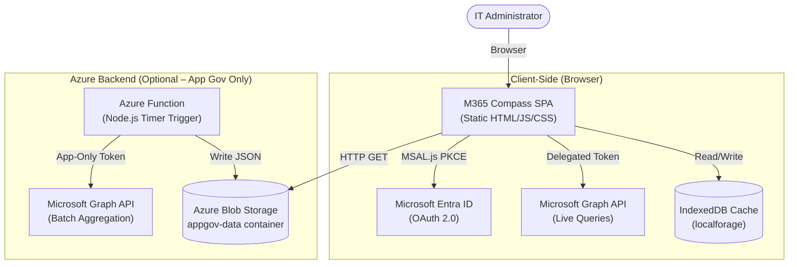

# M365 Compass — Technical Architecture

> **Audience:** Technical architects, IT pros, and security reviewers evaluating M365 Compass for enterprise deployment.

---

## 1. Architecture Summary

M365 Compass is a **hybrid static SPA** (Single-Page Application). The majority of its functionality operates entirely client-side in the browser, with an optional server-side Azure Function used exclusively for Enterprise App Governance data aggregation on large tenants.



---

## 2. Component Breakdown

### 2.1 Frontend SPA

| Property | Detail |
|---|---|
| **Type** | Static Single-Page Application |
| **Languages** | HTML5, Vanilla JavaScript (ES6+), CSS (Tailwind via CDN) |
| **Authentication** | MSAL.js v3 (Browser), Public Client, PKCE flow |
| **Data Visualisation** | Chart.js v4 |
| **Icons** | Lucide Icons |
| **Local Persistence** | `localforage` (IndexedDB abstraction) |
| **Hosting** | Any static web host (Azure Static Web Apps, GitHub Pages, Nginx, etc.) |
| **No Build Required** | ✅ — served directly as-is with no bundler or compiler |

The frontend is composed of modular JavaScript files, one per governance module:

```
js/
├── graph.js              # Core Graph API fetch utilities, paginated calls, token refresh
├── auth.js               # MSAL initialisation, login, logout, config modal
├── ui.js                 # Global routing: Hub → Module transitions
│
├── pages/                # Licence Governance pages
│   ├── overview.js
│   ├── users.js
│   ├── analytics.js
│   └── sku-filter.js
│
├── appgov/               # Enterprise App Governance module
│   ├── ui.js             # Internal router, sidebar navigation
│   ├── graph.js          # App Governance API calls
│   ├── demo.js           # Mock data generator for demo mode
│   └── pages/
│       ├── apps.js       # Application inventory table
│       ├── detail.js     # App detail slide panel
│       ├── inactive.js   # Inactive users per app
│       └── overview.js   # App Gov dashboard
│
└── devicegov/            # Device Governance module
    ├── ui.js             # Internal router, sidebar navigation
    ├── graph.js          # Intune API calls + Defender status normalisation
    ├── demo.js           # Mock device data generator
    └── pages/
        ├── overview.js   # KPI dashboard + charts
        ├── inventory.js  # Filterable device table
        ├── compliance.js # Compliance & Security risk view
        └── detail.js     # Slide-over device detail panel
```

### 2.2 Microsoft Graph API Integration

M365 Compass uses the **Microsoft Graph REST API** exclusively via the browser's `fetch()` API.

#### Endpoints Used

| Module | Endpoint | Purpose |
|---|---|---|
| Licence Gov | `GET /subscribedSkus` | Fetch all M365 licence SKUs |
| Licence Gov | `GET /organization` | Read tenant display name |
| Licence Gov | `GET /users?$select=...&$top=999` | Paginated full user list with sign-in activity |
| App Gov | `GET /servicePrincipals?$select=...` | Enumerate all enterprise applications |
| App Gov | `GET /servicePrincipals/{id}/appRoleAssignedTo` | Get users/groups assigned to each app |
| App Gov | `GET /groups/{id}/transitiveMembers` | Expand group membership (nested) |
| Device Gov | `GET /deviceManagement/managedDevices?$select=...` | Fetch managed device inventory |
| Device Gov | `GET /deviceManagement/managedDevices/{id}` | On-demand single device detail |

#### Pagination
All list endpoints use the `@odata.nextLink` pattern handled by the `graphFetchAll()` utility in `js/graph.js`, which automatically follows continuation tokens until all records are retrieved.

#### Token Management
- Tokens are acquired via `msalInstance.acquireTokenSilent()` on each request
- If silent refresh fails, the library falls back to `acquireTokenPopup()`
- All MSAL scopes are centralised in the `MSAL_SCOPES` constant in `js/auth.js`
- Stale `interaction_in_progress` session locks are auto-cleared before each login attempt

### 2.3 Local Caching (IndexedDB)

Licence Governance data is persisted locally using `localforage` (IndexedDB):

```
IndexedDB Store: lg-cache
├── users         ← Full user array (serialised JSON)
├── skus          ← SKU inventory
├── org           ← Tenant info
└── lastSync      ← Timestamp for cache invalidation display
```

This cache allows the portal to render instantly on subsequent sessions without hitting API rate limits. It is cleared on explicit refresh or sign-out.

### 2.4 Azure Backend (Enterprise App Governance — Optional)

For tenants with thousands of users and hundreds of applications, the full dataset cannot be safely aggregated within a browser session (timeout/memory limits). The optional Azure backend addresses this.

#### Azure Function App

| Property | Detail |
|---|---|
| **Runtime** | Node.js 18+ |
| **Trigger** | Timer (default: every 4 hours or nightly at 02:00) |
| **Auth** | `@azure/identity` ClientSecretCredential (App-Only) |
| **Output** | `data.json` → Azure Blob Storage |

**Processing pipeline:**
1. Fetch all `servicePrincipals` with pagination
2. For each app, fetch `appRoleAssignedTo` (direct users + groups)
3. Expand each group's `transitiveMembers` up to 5 levels
4. Cross-reference all user IDs against the global `auditLogs/signIns` feed
5. Compute `_lastSignIn`, `_inactiveCount`, and `_expandedCount` per app
6. Write the full compiled dataset to Azure Blob Storage as `data.json`

#### Azure Blob Storage

| Property | Detail |
|---|---|
| **Container** | `appgov-data` (public read or CORS-restricted) |
| **Object** | `data.json` (overwritten on each Function run) |
| **Access** | CORS configured to allow requests from the portal's hostname only |
| **Cost** | Negligible (one JSON file, ~1–10 MB depending on tenant size) |

---

## 3. Authentication & Security Architecture

### OAuth 2.0 Authorization Code Flow (PKCE)

```
Browser                    Entra ID                    Graph API
  │                            │                            │
  ├── loginRedirect() ─────────►                            │
  │   (with PKCE challenge)    │                            │
  │◄──── auth code ────────────┤                            │
  │                            │                            │
  ├── exchange code ───────────►                            │
  │   (+ PKCE verifier)        │                            │
  │◄──── access token ─────────┤                            │
  │                            │                            │
  ├── GET /users ──────────────────────────────────────────►│
  │   Authorization: Bearer {token}                         │
  │◄──── user data ────────────────────────────────────────┤│
```

### Delegated vs Application Permissions

| Context | Grant Type | Token Holder | Permissions |
|---|---|---|---|
| Frontend (user browsing) | **Delegated** | Signed-in admin user | Reads on behalf of the user |
| Azure Function (background) | **Application** | The App Registration itself | Reads without a user present |

### Security Controls

| Control | Implementation |
|---|---|
| **Read-only** | All permissions are `*.Read.*` — no write access granted |
| **No data egress** | Data stored only in browser IndexedDB or your own Azure Blob |
| **No telemetry** | Zero tracking, analytics, or external HTTP calls beyond Microsoft APIs |
| **CORS** | Blob Storage configured to restrict access to the portal's hostname |
| **Token scope isolation** | Frontend and backend use separate App Registrations |
| **PKCE** | Prevents authorization code interception attacks |

---

## 4. Data Flow Diagrams

### Licence Governance — Live Client-Side Flow

```
User clicks "Licence Governance"
        │
        ▼
acquireTokenSilent() → Access Token
        │
        ├── GET /subscribedSkus ──────────► Graph API
        ├── GET /organization ────────────► Graph API
        └── GET /users?$select=...&$top=999 (paginated) ► Graph API
                │
                ▼
        Cross-reference users ↔ SKUs
        Compute inactive users, costs, department breakdown
                │
                ▼
        Save to IndexedDB (localforage)
                │
                ▼
        Render KPIs, Charts, Tables
```

### Device Governance — Live + On-Demand Flow

```
User clicks "Device Governance"
        │
        ▼
acquireTokenSilent() → Access Token
        │
        └── GET /deviceManagement/managedDevices?$select=... (paginated)
                │
                ▼
        Normalise defenderStatus from complianceState
        Store in DG.data.devices[]
                │
                ▼
        Render Overview Dashboard (KPIs, Charts, Action Table)

[User clicks a device in the Inventory table]
        │
        └── GET /deviceManagement/managedDevices/{id}?$select=serialNumber,storage,...
                │
                ▼
        Merge into existing device object
        Update slide-over panel in-place
```

---

## 5. Deployment Architecture Options

### Option A — Pure Static (Licence + Device Gov Only)

```
Internet ──► Static Web Host ──► Browser
                                    │
                                    └──► Microsoft Graph API
```
**Cost: £0 — No Azure infrastructure required**

### Option B — Full Stack (All Modules)

```
Internet ──► Static Web Host ──► Browser
                                    │    ├──► Microsoft Graph API
                                    │    └──► Azure Blob Storage ◄── Azure Function
                                                                           │
                                                                           └──► Microsoft Graph API
```
**Azure Cost: ~£3–10/month** (Function App Consumption Plan + Storage)

---

## 6. Scalability Considerations

| Tenant Size | Licence Gov | App Gov | Device Gov |
|---|---|---|---|
| < 500 users | ✅ Live client-side | ✅ Live client-side | ✅ Live client-side |
| 500 – 5,000 users | ✅ Live (with local cache) | ⚠️ Recommend backend | ✅ Live client-side |
| 5,000 – 50,000 users | ✅ Live (with local cache) | ✅ Backend required | ✅ Live client-side |
| > 50,000 users | ⚠️ May require backend | ✅ Backend required | ✅ Live client-side |

> The Device Governance module uses `$select` projection on the Graph API to minimise payload size and is well-suited to tenants with up to ~50,000 devices within normal browser constraints.
